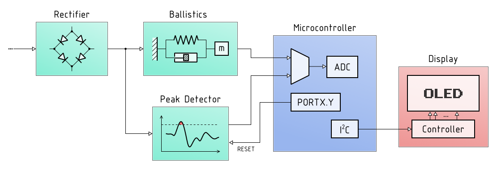
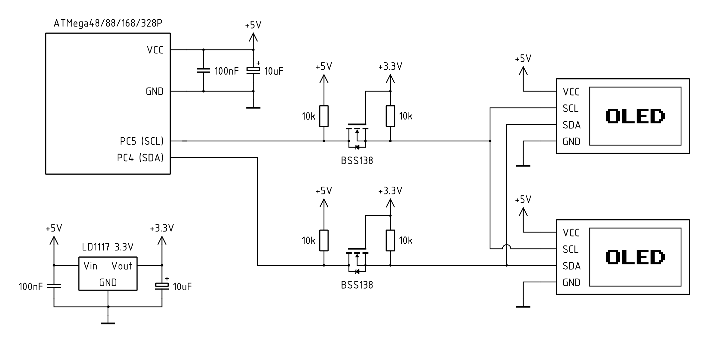

# OLED display VU meter — AVR/Arduino project

This project is to create digital version of a nice gadget that adds a little magic 
to any audio equipment: a [VU meter](https://en.wikipedia.org/wiki/VU_meter).

Project uses AVR ATMega88/168/328, and ATMega48 if possible, so should be compatibile with
Arduino Uno boards. Small (and cheap) monochrome OLED modules with SSD1306 driver are 
employed as displays.

Here's a video showing test of VU meter prototype:

## Design

Full documentation will be included in the future, as the project progresses.

For now here's very high-level block diagram of the device:

Second analog channel and OLED display were omitted for the sake of brevity.

And below you can find a diagram explaining connection between ATMega and OLED displays:

The key issue here is that display controller is supplied with 3.3V from regulator included on its board. This means that SCL and SDA pins logic levels are relative to 3.3V and providing higher voltage there would damage displays. And at the same time VCC pin has to be provided with at least 4.3V, since lower voltage will prevent the regulator from functioning propely.

One solution, presented here, is to power ATMega from 5V supply and use logic-level converters to drive OLED inputs. It's common for such converters (available on SparkFun and similar sites) to use design described in this application note from NXP: [Level shifting techniques in I2C-bus design](https://www.nxp.com/docs/en/application-note/AN10441.pdf). 3.3V supply is provided by local 3.3V regulator (LD1117).

Other equally valid solution would be to power ATMega from 3.3V, thus forgoing level-shifting. 5V supply would still be needed for OLED's supply pins.
