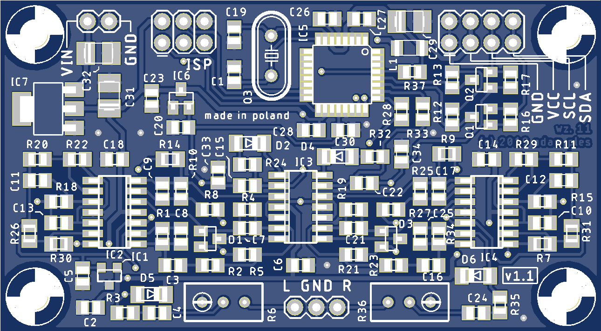
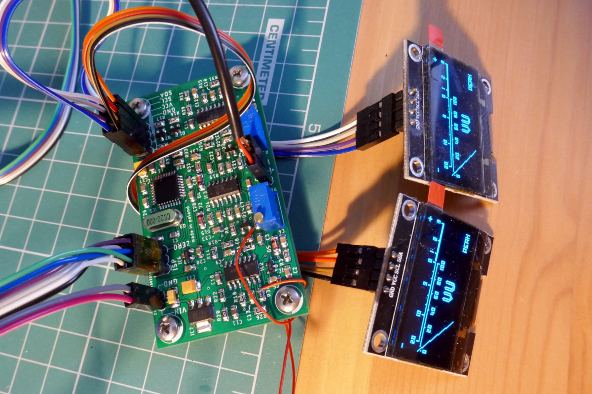
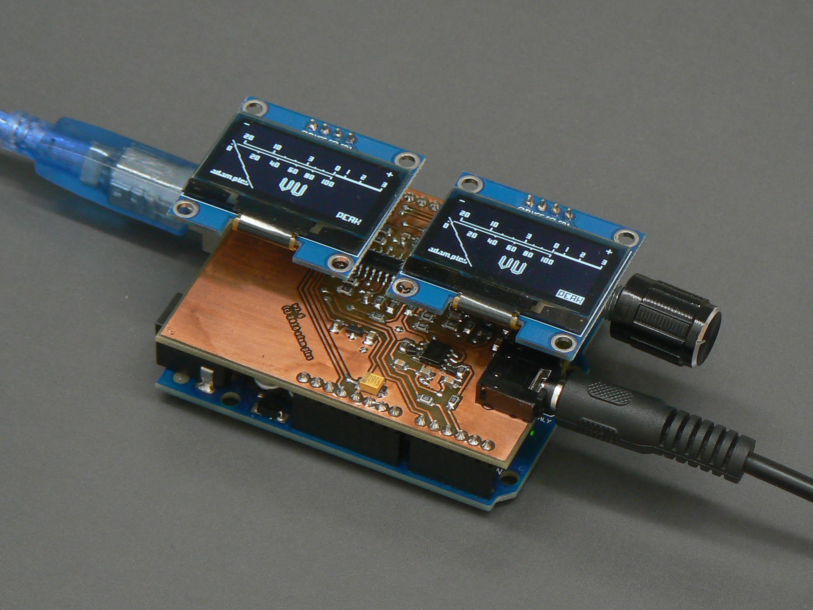

# OLED display VU meter — AVR/Arduino project

This project is to create digital version of a nice gadget that adds a little magic 
to any audio equipment: a [VU meter](https://en.wikipedia.org/wiki/VU_meter). Main design
goals are:
  - 2-channel operation,
  - as close to real VU-meter specification as possible,
  - high FPS, 60+ — no visible jumping of needle, as is common in other designs.

Project uses AVR ATMega88/168/328 (and ATMega48 if possible), so should be compatibile with
Arduino Uno boards. Small (and cheap) monochrome OLED modules with SSD1306 or SH1106 driver are 
employed as displays. Unlike other AVR VU meters that you can find on the web this one uses
quite complex analog circuitry (it can be much simpler if you are not as interested as me in
up-to-specs VU meter emulation).

Here's a video showing test of VU meter prototype:

[](https://www.youtube.com/watch?v=tU8fmWirxTw)

## Building The Project

To build hex file you'll need:
  - avr-gcc,
  - GNU make,
  - Python 2.7 or 3.
For windows you can use this distribution of gcc and make: http://blog.zakkemble.co.uk/avr-gcc-builds/

Before compilation please modify [src/config.h](src/config.h) file to set proper OLED controller type and [Makefile](Makefile) to set uC type and oscillator frequency (F_CPU).

To create hex file type:
```
$ make all
```
This will create `build/main.hex` that you can use to flash your device.

__Note: This is Work In Progress design. To make it work for you you'll most probably need to modify it in one way or another.__

## Hardware Design

If you would like to make VU meter yourself here are some useful files for you:
  - [hardware/vu_meter.sch](hardware/vu_meter.sch) — schematic (in Eagle 8 format)
  - [hardware/vu_meter.brd](hardware/vu_meter.brd) — PCB design (in Eagle 8 format)
  - [hardware/vu_meter_sch.pdf](hardware/vu_meter_sch.pdf) — schematic as PDF
  - [hardware/bom.ods](hardware/bom.ods) — bill of materials (open document)
  - [hardware/vu_meter.zip](hardware/vu_meter.zip) — gerber files ready for production

PCB is designed as a module to be included in other devices so all signals are connected using goldpin headers:



There is also Arduino UNO shield (rev.3) design, altough it's not very polished version:
  - [hardware/arduino_shield.sch](hardware/arduino_shield.sch) — schematic (in Eagle 8 format)
  - [hardware/arduino_shield.brd](hardware/arduino_shield.brd) — PCB design (in Eagle 8 format)



Full documentation will be included in the future, as the project progresses.

For now here's very high-level block diagram of the device:


Second analog channel and OLED display were omitted for the sake of brevity.

