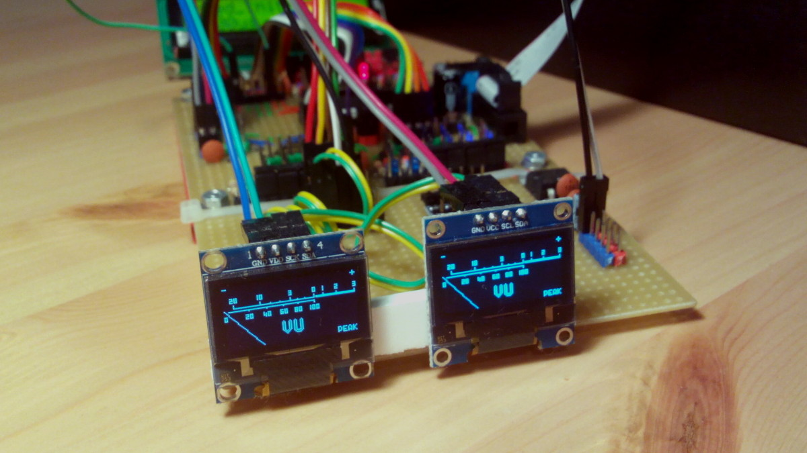

# Journal

No records before this date survived.

## 23th November 2017

Got the project to a working state: both displays are showing the same animation of a needle in low FPS (~10). 
Peak indicator is flashing when needle goes far enough to the right.

FPS is currently so low because of several reasons:
- whole screen is re-rendered each time,
- rendering is async, but rendering and sending doesn't actually overlap.

For now I'll focus on the second issue. The plan is to modify I2C driver to use double buffering.

Possible next steps:
- write all operations to the buffer (sending start/stop conditions, sending address), so reading buffer 
can be decoupled from tasks logic,
- provide better format for the buffer, that is both efficient and concise.
